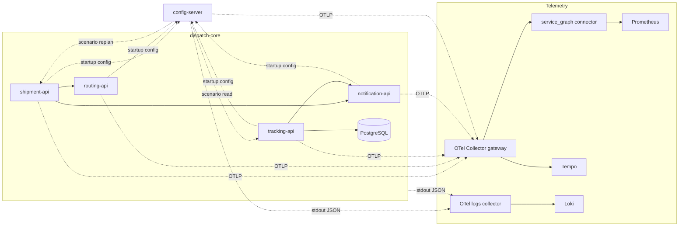
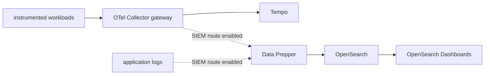

# Every Cloud Attack Leaves a Trace

A local cloud security PoC for Ekoparty 2026.

The lab starts after `config-server` has been compromised.

There is no malware to explain. There is no exploit chain to stage. The attacker already has a valid internal key and can reach services that were already reachable.

Every hop works.

DNS works. TCP works. Authentication works. The HTTP response is `200`. PostgreSQL does exactly what it was asked to do.

The problem appears when we ask who caused the request and why that service relationship exists.

## The point

An HTTP status describes one request.

A trace describes a story.

This lab is about the second question.

The useful signal is not a failed request. It is a new causal edge in an otherwise healthy service graph.

## The story you are about to run

The platform handles freight and dispatch operations.

`shipment-api` plans shipments through `routing-api` and sends a notification. `tracking-api` reads vehicle positions from PostgreSQL and sends a notification. All four application services load their configuration from the legacy `config-server` during startup.

After the compromise, the same `config-server` process starts a normal internal request.

It asks `tracking-api` for fleet positions.

The request is accepted. The query succeeds. The path is still wrong.

## Architecture



The solid lines are expected runtime calls. The dotted startup calls happen while services load configuration. The two dotted calls from `config-server` to business services appear only when a scenario is run.

The first investigation uses the terminal. No dashboard is needed to find the problem.

## One program

Every application runs the same Go program.

There is one `main.go`, one binary called `trace-lab`, and one container image. The subcommand selects the process role.

```bash
go run . shipment-api
go run . routing-api
go run . tracking-api
go run . notification-api
go run . config-server
```

The scenario commands use the same binary inside the existing `config-server` Pod.

```bash
go run . scenario-read
go run . scenario-replan
```

The deployed application uses the compiled binary.

```text
/app/trace-lab shipment-api
/app/trace-lab routing-api
/app/trace-lab tracking-api
/app/trace-lab notification-api
/app/trace-lab config-server
```

There is no attacker Pod. There is no extra service pretending to be one.

## Before you start

You need Docker, Minikube, `kubectl`, Helm, Go, `jq`, `column`, and OpenSSL.

For the terminal investigation you also need `promtool`, `tempo-cli`, and `logcli`.

The baseline Minikube profile uses 6 CPUs, 12 GiB of memory, and 30 GiB of disk.

The lab uses ephemeral storage. Delete it when you are done.

See the available local commands.

```bash
make help
```

```text
  help             Show the available commands.
  check            Run formatting and static analysis.
  up               Prepare the local platform without deploying applications.
  ready            Verify that the PoC workloads are ready.
  stop             Stop the Minikube profile and keep its data.
  start            Start an existing Minikube profile.
  status           Show Pods and Services in the PoC.
  ports            Print the core port forwards.
  traffic          Generate normal application traffic.
  scenario-read    Run the compromised read scenario.
  scenario-replan  Run the compromised replan scenario.
  siem-on          Enable the optional OpenSearch telemetry route.
  siem-off         Disable the optional OpenSearch telemetry route.
  siem-rule        Create the unexpected-edge OpenSearch monitor.
  siem-ports       Print the optional OpenSearch port forwards.
  reset            Delete the Minikube profile and its local data.
```

## 1. Check the program

Start with the boring part. Boring is good. It means the demo will not fail because of formatting or a stale binary.

```bash
make check
```

The command exits cleanly after running `gofmt` and `go vet`.

## 2. Prepare the platform

This prepares Minikube, installs the local platform components, builds the image, creates PostgreSQL, and stops before deploying application workloads.

```bash
make up
```

The useful part of the output looks like this.

```text
Platform is ready.
Deploy application workloads from the README with kubectl.
```

The image is already loaded into Minikube. The application workloads are still absent.

The internal key and database password are generated into Kubernetes Secrets when they do not already exist. They are not stored in the repository.

## 3. Deploy the workloads

The image is already loaded into Minikube. Apply the five application roles directly.

```bash
kubectl apply -f workloads.yaml

kubectl -n dispatch-core rollout status deployment/shipment-api --timeout=180s
kubectl -n dispatch-core rollout status deployment/routing-api --timeout=180s
kubectl -n dispatch-core rollout status deployment/tracking-api --timeout=180s
kubectl -n dispatch-core rollout status deployment/notification-api --timeout=180s
kubectl -n config rollout status deployment/config-server --timeout=180s
```

The useful part of the output looks like this.

```text
deployment "shipment-api" successfully rolled out
deployment "routing-api" successfully rolled out
deployment "tracking-api" successfully rolled out
deployment "notification-api" successfully rolled out
deployment "config-server" successfully rolled out
```

`tracking-api` connects to PostgreSQL during startup. It creates `vehicle_positions` if needed and inserts three demo rows.

The internal key is a bearer secret. It is not a password hash. There is no salt or pepper because the application needs the exact value on every internal request.

The point of the secret is to show that authentication can succeed while the caller is still wrong for the operation.

Check the running services.

```bash
make status
```

The relevant service names include the following.

```text
dispatch-core   dispatch-db-rw
dispatch-core   shipment-api
dispatch-core   routing-api
dispatch-core   tracking-api
dispatch-core   notification-api
config          config-server
tempo           tempo
prometheus      prometheus-server
loki            loki
```

## 4. Open the terminal backends

The first run uses three backends with three jobs.

Prometheus shows a new relationship.

Tempo shows the causal trace.

Loki shows what the applications recorded.

Print the port forwards.

```bash
make ports
```

```text
Tempo:      kubectl -n tempo port-forward svc/tempo 3200:3200
Prometheus: kubectl -n prometheus port-forward svc/prometheus-server 9090:80
Loki:       kubectl -n loki port-forward svc/loki 3100:3100
Tracking:   kubectl -n dispatch-core port-forward svc/tracking-api 18081:8080
Shipment:   kubectl -n dispatch-core port-forward svc/shipment-api 18080:8080
```

Run these in separate terminals.

```bash
kubectl -n tempo port-forward svc/tempo 3200:3200
kubectl -n prometheus port-forward svc/prometheus-server 9090:80
kubectl -n loki port-forward svc/loki 3100:3100
```

```text
Forwarding from 127.0.0.1:3200 -> 3200
Forwarding from 127.0.0.1:9090 -> 80
Forwarding from 127.0.0.1:3100 -> 3100
```

The laptop is only forwarding ports and sending requests. It is not instrumented.

## 5. Create normal traffic

Keep this running in its own terminal.

```bash
make traffic
```

```text
normal traffic is running
```

The traffic loop calls the public tracking and shipment endpoints. The application calls produce the expected edges.

```text
shipment-api   routing-api
shipment-api   notification-api
tracking-api   notification-api
tracking-api   PostgreSQL
```

## 6. Ask Prometheus about the graph

The Collector derives service graph metrics from traces. Prometheus stores only those metrics for this lab.

The connector flushes every five seconds so the result does not arrive after the talk has ended.

Run the baseline query.

```bash
promtool query --format=json instant \
  http://127.0.0.1:9090 \
  'sum by (client, server, connection_type) (
     increase(traces_service_graph_request_total{
       connection_type!="virtual_node",
       server!="unknown"
     }[5m])
   )' |
jq -r '.[] | [.metric.client, .metric.server, (.metric.connection_type // "-"), .value[1]] | @tsv' |
column -t
```

```text
shipment-api  routing-api       -  52.73
shipment-api  notification-api  -  51.69
tracking-api  notification-api  -  57.90
```

The numbers will move while `make traffic` is running. The important thing is the set of relationships.

## 7. Run the first scenario

The scenario command signals the existing `config-server` process. That process makes the internal call itself.

No request from the laptop becomes the root span shown in the investigation.

```bash
make scenario-read
```

```text
{"scenario":"read","status":"completed","downstream":"tracking-api"}
```

Wait five seconds for the service graph connector and run the same PromQL query again.

```text
shipment-api   routing-api       -  53.73
shipment-api   notification-api  -  52.69
tracking-api   notification-api  -  58.90
config-server  tracking-api      -   1
```

There it is.

Not an error. Not a failed health check. A new relationship.

Check whether it failed.

```bash
promtool query --format=json instant \
  http://127.0.0.1:9090 \
  'sum(increase(traces_service_graph_request_failed_total{client="config-server",server="tracking-api"}[5m])) or vector(0)' |
jq -r '.[0].value[1] // "0"'
```

```text
0
```

The request worked.

## 8. Follow the trace

Prometheus tells you that a relationship appeared. It does not tell you why.

Ask Tempo for a direct child relationship.

```bash
tempo-cli query api search \
  127.0.0.1:3200 \
  '{ resource.service.name = "config-server" } > { resource.service.name = "tracking-api" }' \
  now-5m now |
jq -r '.traces[] | [.traceID, .rootServiceName, .rootTraceName] | @tsv'
```

```text
4b806edc2f1c3c9373158a1d508c6237  config-server  GET
```

The `>` operator means a direct child.

Now follow descendants until the database operation appears.

```bash
tempo-cli query api search \
  127.0.0.1:3200 \
  '{ resource.service.name = "config-server" } >> { span.db.operation.name = "SELECT" }' \
  now-5m now |
jq -r '.traces[] | [.traceID, .rootServiceName, .rootTraceName] | @tsv'
```

```text
4b806edc2f1c3c9373158a1d508c6237  config-server  GET
```

The `>>` operator follows descendants at any depth.

The trace story is now clear.

```text
config-server  GET
tracking-api   GET /internal/fleet/positions
tracking-api   SELECT vehicle_positions
```

`tracking-api` did exactly what it is supposed to do. The caller that caused it should not have been there.

If you want the complete trace, use the ID returned by the search.

```bash
tempo-cli query api trace-id \
  http://127.0.0.1:3200 \
  4b806edc2f1c3c9373158a1d508c6237 |
jq -r '.resourceSpans[] |
  ((.resource.attributes |
    map({key: .key, value: (.value.stringValue // .value.intValue // "")}) |
    from_entries)["service.name"]) as $service |
  .scopeSpans[].spans[] |
  [$service, .kind, .name] |
  @tsv'

```

```text
tracking-api   SPAN_KIND_SERVER  GET /internal/fleet/positions
tracking-api   SPAN_KIND_CLIENT  SELECT vehicle_positions
config-server  SPAN_KIND_CLIENT  GET
```

The trace ID changes on every run.

## 9. Read what the applications recorded

The trace gives you the path. Loki gives you the application evidence around that path.

```bash
export LOKI_ADDR=http://127.0.0.1:3100
logcli query --quiet --since=5m -o raw \
  '{service_name="tracking-api"} | json | path="/internal/fleet/positions"'
```

```json
{"time":"2026-10-05T09:23:46.598908432Z","level":"INFO","msg":"request","service":"tracking-api","event":"request","method":"GET","path":"/internal/fleet/positions","status":200,"duration_ms":1,"bytes":398,"remote_addr":"10.244.2.138:53146"}
```

The service returned `200`.

That is the point. The log is healthy. The trace is suspicious.

The PoC correlates the three backends by service, route, and time. It does not add trace IDs to the application logger.

## 10. Run the second scenario

The read scenario ends in a database query. The replan scenario shows a valid business operation with fan-out.

```bash
make scenario-replan
```

```text
{"scenario":"replan","status":"completed","downstream":"shipment-api"}
```

The trace has this shape.

```text
config-server
    shipment-api
        routing-api
        notification-api
```

Find the downstream routing call.

```bash
tempo-cli query api search \
  127.0.0.1:3200 \
  '{ resource.service.name = "config-server" } >> { resource.service.name = "routing-api" }' \
  now-5m now |
jq -r '.traces[] | [.traceID, .rootServiceName, .rootTraceName] | @tsv'
```

```text
2d85987fbb68a493290d5f7ff2331073  config-server  POST
```

The fan-out is legitimate from the point of view of `shipment-api`.

The strange part is the caller that started it.

## What the first act proves

Every local operation succeeded.

The internal key was valid. The downstream services were healthy. PostgreSQL executed a normal `SELECT`. The status codes stayed green.

The violation is architectural.

`config-server` was expected to provide configuration during startup. It was not expected to initiate runtime business operations.

That is why a trace is more useful than a pile of error counters for this story.

## The expected graph is data

The application Deployments carry a small `trace-lab.io/allowed-edges` annotation in `workloads.yaml`.

It describes the caller, target, HTTP method, and path combinations that belong to the expected graph.

The annotation is passive metadata. Kubernetes does not use it to permit or deny traffic. The application behaves the same whether the annotation exists or not.

The metadata only becomes useful when `make siem-rule` reads it and turns the expected graph into detection logic.

This is a map, not an enforcement mechanism.

## The security controls are a separate conversation

A hardened deployment could stop this request earlier.

Kubernetes NetworkPolicy can restrict which Pods may connect to other Pods and ports. Dapr can add application identity and operation-level access control for calls that use its service invocation layer.

Those controls are outside the first act because they would turn the scenario into a blocked connection or a `403`. `tracking-api` would never execute the SQL query, so the audience would miss the downstream evidence.

NetworkPolicy works at the network layer. Dapr access control works at the application invocation layer. Neither replaces the trace investigation.

[Kubernetes NetworkPolicy](https://kubernetes.io/docs/concepts/services-networking/network-policies/)

[Dapr service invocation access control](https://docs.dapr.io/operations/configuration/invoke-allowlist/)

## The second act with OpenSearch

The terminal investigation already found the edge and followed the story. Now OpenSearch adds a UI for the same evidence.

It is optional. The normal deployment does not start it, and the first act does not depend on it.

Turn on the extra telemetry route.

```bash
make siem-on
```

```text
OpenSearch API is ready
deployment "data-prepper" successfully rolled out
deployment "opensearch-dashboards" successfully rolled out
telemetry route enabled
```

The optional stack uses one OpenSearch Pod with a 512 MiB heap and a 1 GiB memory limit. Data Prepper runs one Pod with a 256 MiB heap and a 768 MiB memory limit. Dashboards runs one Pod with a 512 MiB memory limit.

There are no replicas and no persistence. This is a local investigation surface, not a production cluster pretending to be one.

Security is disabled for this local stack. OpenSearch, Data Prepper, and Dashboards use plain HTTP inside the Minikube cluster. Dashboards does not ask for a username or password.

The extra route looks like this.



Create the monitor from the workload map.

```bash
make siem-rule
```

```text
trusted edges      8
detection scope    caller, target, method and path
```

The command also prints the generated monitor ID.

The monitor looks for HTTP client spans that are not part of the declared graph. It does not contain a special case for `config-server`.

If another workload becomes the unexpected caller, the same monitor can flag it.

OpenSearch Alerting stores the monitor. Data Prepper receives the optional OTLP trace and log traffic. The detector still starts with the expected graph and the observed trace.

Open the optional services when you want the UI.

```bash
make siem-ports
```

```text
OpenSearch API: kubectl -n opensearch port-forward svc/opensearch-cluster-master 9200:9200
Dashboards:     kubectl -n opensearch port-forward svc/opensearch-dashboards 5601:5601
Data Prepper traces: kubectl -n opensearch port-forward svc/data-prepper 21890:21890
Data Prepper logs:   kubectl -n opensearch port-forward svc/data-prepper 21892:21892
```

Run the scenario and verify that the telemetry reached OpenSearch and that the monitor sees the new edge.

```bash
make siem-verify
```

A successful run ends like this.

```text
{"scenario":"read","status":"completed","downstream":"tracking-api"}
OpenSearch cluster  yellow
Trace documents     48
Log documents       43
Scenario edge docs  1
Tracking status     200
Unexpected edge     true
```

The document counts depend on how long normal traffic has been running. The important values are the `200` response, the scenario edge, and the triggered monitor.

Open `http://127.0.0.1:5601` after forwarding the Dashboards service. No login is required.

Search for `config-server`, `tracking-api`, and `/internal/fleet/positions`.

The UI is useful now because the question has already been reduced to one suspicious relationship. It is not being used as a substitute for understanding the trace.

Turn the extra route off when you are done.

```bash
make siem-off
```

```text
telemetry route disabled
```

Tempo, Prometheus, and Loki remain available.

## Clean up

```bash
make reset
```

```text
Deleted minikube profile trace-lab
```

## The line to remember

```text
HTTP 200 says the request succeeded.
The trace says whether the path should have existed.
```

## References

[Tempo CLI](https://grafana.com/docs/tempo/latest/operations/tempo_cli/)

[TraceQL](https://grafana.com/docs/tempo/latest/traceql/construct-traceql-queries/)

[promtool](https://prometheus.io/docs/prometheus/latest/command-line/promtool/)

[logcli](https://grafana.com/docs/loki/latest/query/logcli/getting-started/)

[OpenSearch Alerting API](https://docs.opensearch.org/latest/observing-your-data/alerting/api/)
