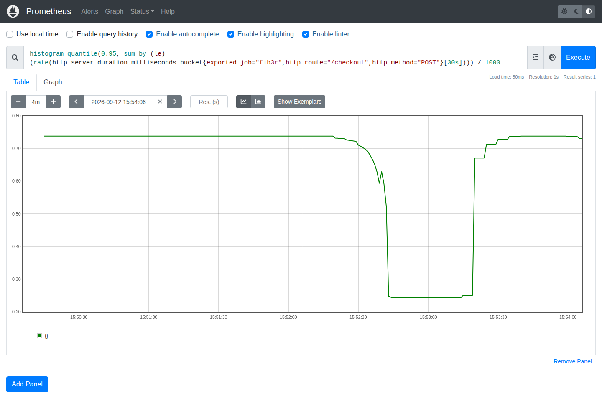
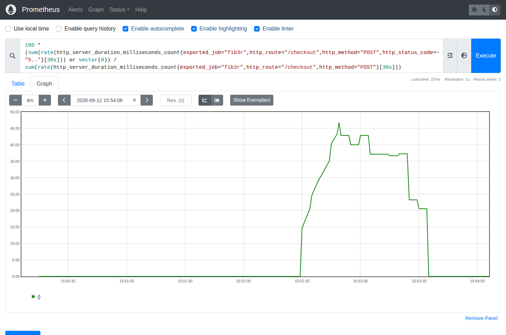

# Hide Your Mistakes Wihout a Rollback

This is the proof of concept from the OpenFeature talk I gave with Valentín Martinez at the second edition of F13 Code Summit.

Checkout V2 is faster. Then it starts failing. Change one flag to return to the stable implementation without redeploying.

Clone the Playground, apply the patch, and follow the steps below to reproduce the demo.

This is a local simulation. It does not process payments. Bring two terminals and a browser. Prometheus graphs are optional.

## 1. Clone and apply

Start in the directory containing this README and `playground.patch`. You need Git, Docker with Compose, and curl.

```bash
POC_DIR="$PWD"

git --version
docker --version
docker compose version
docker info >/dev/null
```

If `docker info` fails, start Docker first.

Use the exact commit below. The patch was tested against it.

```bash
git clone https://github.com/open-feature/playground.git
cd playground
git switch -c checkout-v2-poc 6ddba35e86678bf5150211c53e973f43ae47e706

git apply --check "$POC_DIR/playground.patch"
git apply "$POC_DIR/playground.patch"
git diff --stat
```

Use a fresh directory if `playground` already exists. Apply the patch once.

## 2. Build and start

Run from the cloned repository root.

```bash
docker compose config >/dev/null
docker compose build demo
docker compose up -d demo fib-service flagd flagd-ui otel-collector jaeger prometheus
docker compose ps
```

All seven services should be `Up`. Only `demo` builds locally. The others use published images.

Prometheus starts because the existing Collector depends on it in Compose. Opening its graphs is optional.

If another Playground installation is running, stop it from its own directory with `docker compose down`. These installations share ports and container names.

## 3. Start with Stable

**In your browser**, open [flagd-ui](http://localhost:4000). Under **Basic**, find `checkout-v2` and select **off**. It saves automatically. Leave the other flags alone.

In your first terminal, send a request.

```bash
curl -sS -i -w '\nElapsed %{time_total}s\n' \
  -X POST http://localhost:30000/checkout
```

Expect HTTP 200, roughly 0.700 seconds, and this response.

```json
{"status":"paid","checkout":"stable"}
```

Record the container identities before changing the flag. Keep this terminal open so it retains `POC_RUN`.

```bash
POC_RUN=$(mktemp -d /tmp/checkout-poc.XXXXXX)

docker inspect $(docker compose ps -q demo flagd flagd-ui) \
  --format '{{.Name}} {{.Id}} {{.State.StartedAt}} {{.RestartCount}}' \
  | sort > "$POC_RUN/before.txt"
```

## 4. Keep requests coming

Open a second terminal in the same repository and run this loop.

```bash
while true; do
  curl -sS --max-time 5 -o /dev/null \
    -w '%{http_code} %{time_total}s\n' \
    -X POST http://localhost:30000/checkout
  sleep 0.2
done
```

Leave it running throughout the demo.

```text
200 0.707s
200 0.705s
200 0.708s
```

> The original checkout is slow. Every request succeeds.

## 5. Enable V2

**In your browser**, return to [flagd-ui](http://localhost:4000). Change `checkout-v2` from **off** to **on**.

Watch the traffic terminal immediately.

```text
200 0.155s
200 0.154s
200 0.156s
```

> V2 is much faster.

Wait five seconds from the first V2 request. Errors begin without another button or flag.

```text
200 0.155s
503 0.156s
200 0.154s
503 0.155s
```

> It looked good. Now the new path is failing intermittently.

Each request after the grace period has a 40% chance of failure. The sequence varies between runs.

## 6. Switch back

**In your browser**, change `checkout-v2` from **on** to **off** in [flagd-ui](http://localhost:4000).

The traffic terminal returns to successful, slower responses.

```text
200 0.707s
200 0.705s
200 0.706s
```

> We haven't fixed V2. We stopped sending new requests through it. Slower is acceptable. Failing isn't.

A request already executing V2 may still return 503. Subsequent requests that evaluate the updated flag use Stable.

In the first terminal, check the response and compare the containers.

```bash
curl -sS -w '\n%{http_code} %{time_total}s\n' \
  -X POST http://localhost:30000/checkout

docker inspect $(docker compose ps -q demo flagd flagd-ui) \
  --format '{{.Name}} {{.Id}} {{.State.StartedAt}} {{.RestartCount}}' \
  | sort > "$POC_RUN/after.txt"

diff -u "$POC_RUN/before.txt" "$POC_RUN/after.txt"
```

Expect the `stable` response, HTTP 200, and no diff output. The containers kept their identities, start times, and restart counts.

## 7. Optional Prometheus graphs

**In your browser**, open [Prometheus](http://localhost:9090/graph). Paste the latency query below, click **Execute**, select **Graph**, and use a **5m** range. Click **Add Panel** and do the same with the error-rate query.

Keep traffic running for about **40 seconds per phase**. Run Stable, enable V2, then switch back. Keep the graph end time at the present and click **Execute** to refresh.

### Checkout latency in seconds

```promql
histogram_quantile(
  0.95,
  sum by (le) (
    rate(http_server_duration_milliseconds_bucket{
      exported_job="fib3r",
      http_route="/checkout",
      http_method="POST"
    }[30s])
  )
) / 1000
```

### Checkout errors as a percentage

```promql
100 *
(
  sum(rate(http_server_duration_milliseconds_count{
    exported_job="fib3r",
    http_route="/checkout",
    http_method="POST",
    http_status_code=~"5.."
  }[30s])) or vector(0)
)
/
sum(rate(http_server_duration_milliseconds_count{
  exported_job="fib3r",
  http_route="/checkout",
  http_method="POST"
}[30s]))
```

### Evidence from a verified run

Latency drops with V2 and rises when Stable takes over again.



Errors appear while V2 is active and return to zero after switching back.



These screenshots show a previous run. Your exact values will vary. P95 is estimated from histogram buckets, and the 30-second window makes transitions gradual. Watch the terminal for the first five healthy seconds of V2.

## 8. Repeat or stop

To repeat, let at least one request use Stable while the flag is **off**. That resets the timer. Turn V2 **on** in flagd-ui for another five-second grace period.

To finish, leave `checkout-v2=off` and press **Ctrl+C** in the traffic terminal.

To stop the stack, run this from the repository root.

```bash
docker compose down
```

## Troubleshooting

```bash
docker compose ps
docker compose logs --tail=80 demo flagd flagd-ui otel-collector

curl -fsS http://localhost:4000/api/read
curl -sS -i -X POST http://localhost:30000/checkout
```

If `/checkout` returns 404, rebuild and recreate `demo`.

```bash
docker compose build demo
docker compose up -d --no-deps demo
```

## What the patch contains

- `POST /checkout`, its NestJS service, and one new flag named `checkout-v2`, initially off.
- A 700 ms Stable path and a 150 ms V2 path with a five-second grace period and simulated failures.
- A local `demo` image with the build and lockfile fixes needed to compile it.
- Official flagd-ui with a shared flag directory and `demo.flagd.json`.
- OTLP HTTP enabled in the existing Collector.
- `FLAGD_RESOLVER=in-process` for compatibility between the current SDK and flagd v0.11.5.

The patch excludes backup files. It adds no React changes, custom metrics, or database. The flagd-ui secret is for local demos only. The source commit is pinned. Some image tags remain mutable, including `latest-flagd-ui`.

The original [Playground](http://localhost:30000) and [Jaeger](http://localhost:16686) remain available.
