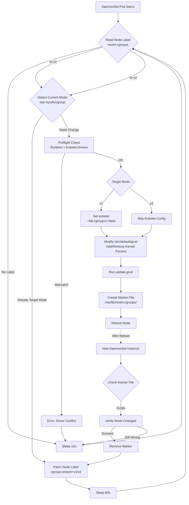

# Legacy JVM On Kubernetes? Enjoy Your OOM

## Problem Statement

Production Kubernetes clusters running modern Linux distributions encounter a critical failure mode when executing legacy JVM workloads. Containers terminate with `OOMKilled` status while application logs contain no corresponding `OutOfMemoryError` exceptions. This behavior indicates a fundamental incompatibility between JVM runtime assumptions and kernel-level resource management.

The root cause stems from architectural changes in Linux control groups (cgroups). JVM builds compiled with cgroups v1 support cannot correctly detect container memory limits on systems running cgroups v2. When memory detection fails, the JVM defaults to host-level memory information from `/proc/meminfo`, configuring heap sizes that vastly exceed actual container boundaries. The kernel OOM killer terminates these processes before the JVM can respond with application-level error handling.

## Technical Background

Linux kernel versions 5.8+ and modern distributions (Ubuntu 22.04+, RHEL 9+, Debian 11+) boot into cgroups v2 by default. This unified hierarchy replaces the cgroups v1 multiple-hierarchy model. The filesystem layout changed fundamentally.

| cgroups Version | Memory Limit Path                              |
|-----------------|------------------------------------------------|
| v1              | `/sys/fs/cgroup/memory/memory.limit_in_bytes` |
| v2              | `/sys/fs/cgroup/memory.max`                    |

Legacy JVM builds attempt to read v1 paths. When these paths return `ENOENT`, the JVM's fallback mechanism reads host memory instead of container memory. This causes heap misconfiguration and immediate OOM termination under container limits.

OpenJDK implemented cgroups v2 detection in specific patch releases.

| JDK Version | Minimum Required | cgroups v2 Support |
|-------------|------------------|--------------------|
| JDK 8       | < 8u372 / ≥ 8u372 | April 2023         |
| JDK 11      | < 11.0.16 / ≥ 11.0.16 | July 2022          |
| JDK 17+     | All versions     | Native             |

Builds prior to these versions lack the necessary filesystem detection logic for the unified hierarchy.

## Demonstration Methodology

This laboratory environment reproduces the failure mode through controlled comparison. Two pods execute identical Java memory allocation code under identical resource constraints (`memory: 256Mi`). The independent variable is JDK version.

| Pod       | JDK Version                   | cgroups Support |
|-----------|-------------------------------|------------------|
| new       | Eclipse Temurin 8u372         | v2 capable       |
| old       | Eclipse Temurin 8u362         | v1 only          |

The demonstration runs on a local K3s cluster provisioned through Lima VM management. This provides a reproducible cgroups v2 environment without requiring cloud infrastructure or physical hardware.

## Prerequisites
## Environment Provisioning

Create a Lima VM with Ubuntu 24.04 and K3s using the provided configuration.

```bash
limactl delete -f grubk3s 2>/dev/null || true
limactl create --tty=false --name=grubk3s os.yaml
limactl start grubk3s
```

The `os.yaml` configuration specifies Ubuntu cloud image with GRUB bootloader support and K3s installation. Provisioning requires approximately 60 seconds for initial boot and Kubernetes component initialization.

Verify cgroup mode.

```bash
limactl shell grubk3s -- sh -c 'stat -fc %T /sys/fs/cgroup'
```

Expected output is `cgroup2fs`. This confirms the kernel mounted the unified cgroups v2 hierarchy. Output of `tmpfs` would indicate cgroups v1 mode.

Confirm Kubernetes node status.

```bash
limactl shell grubk3s -- sudo kubectl get nodes -o wide
```

The node should report `Ready` status. If status shows `NotReady`, allow additional initialization time before proceeding.

## Extending cgroups v1 Support Window

Starting in Kubernetes 1.35, kubelet refuses to start on cgroups v1 nodes by default. This behavior represents the final phase before complete code removal in 1.37+. Organizations with legacy JVM workloads that cannot immediately upgrade to cgroups v2-compatible builds face a critical operational challenge.

The `revert-cgroups` DaemonSet provides a temporary workaround to extend the support window. By reverting nodes to cgroups v1 mode and configuring kubelet to tolerate v1, clusters can continue operating while JVM upgrades are staged and validated.

### Architecture and Operation

The DaemonSet implements a control loop that monitors node labels and coordinates three distinct operations: kubelet configuration, GRUB modification, and node label patching. The following diagram illustrates the state machine:



### Component Analysis

**ServiceAccount and RBAC**

The DaemonSet requires a ServiceAccount with ClusterRole permissions to `get` and `patch` Node resources. This enables the control loop to read the target state from `metadata.labels.revert-cgroups` and write the completion status to `metadata.labels.cgroup-version`.

**NodeAffinity Scheduling Logic**

The DaemonSet uses complex nodeAffinity expressions to schedule pods only on nodes requiring action:

```yaml
nodeSelectorTerms:
  - matchExpressions:
      - key: revert-cgroups
        operator: In
        values: ["to-v1"]
      - key: cgroup-version
        operator: DoesNotExist
```

This expression schedules a pod when the node has `revert-cgroups=to-v1` but lacks the `cgroup-version` label. Once the operation completes and the pod applies `cgroup-version=v1`, the affinity no longer matches and Kubernetes evicts the pod. This prevents redundant reboots.

**Cgroup Mode Detection**

The script detects current cgroup mode by testing for v2-specific files:

```bash
get_cgroup_mode() {
  if nsenter -t 1 -m test -f /sys/fs/cgroup/cgroup.controllers; then
    echo v2
  else
    echo v1
  fi
}
```

The presence of `cgroup.controllers` indicates cgroups v2. This file exists only in the unified hierarchy and contains the list of available controllers (cpu, memory, io, pids).

**Kubelet Configuration Injection**

Before modifying GRUB, the script ensures kubelet will accept cgroups v1 after reboot. It attempts three configuration paths in order:

1. `/etc/default/kubelet` (Debian/Ubuntu) - Injects `KUBELET_EXTRA_ARGS="--fail-cgroupv1=false"`
2. `/etc/sysconfig/kubelet` (RHEL/CentOS) - Same injection
3. `/var/lib/kubelet/config.yaml` - Adds `failCgroupV1: false`
4. `/etc/rancher/k3s/config.yaml` (K3s) - Adds `kubelet-arg: [fail-cgroupv1=false]`

The script modifies existing files in-place using `sed` and `awk`, preserving other configuration while adding the required flag.

**Preflight Runtime Validation**

Before rebooting, the script validates that kubelet and container runtime cgroup drivers match:

```bash
preflight_runtime() {
  want="$1"
  kubelet_driver="$(kubelet_cgroup_driver)"
  runtime_driver="$(runtime_cgroup_driver)"
  
  [ "$kubelet_driver" = "$runtime_driver" ] || die "driver mismatch"
  [ "$want" = "v2" ] && [ "$kubelet_driver" = "systemd" ] || die "v2 requires systemd driver"
}
```

Mismatched drivers cause kubelet startup failures. The script detects containerd's `SystemdCgroup` setting from `/etc/containerd/config.toml` and CRI-O's `cgroup_manager` from `/etc/crio/crio.conf`. If drivers don't align, the script aborts without rebooting.

**GRUB Modification**

The script modifies `/etc/default/grub` to add or remove kernel parameters:

For cgroups v1 mode:
```bash
GRUB_CMDLINE_LINUX_DEFAULT="... systemd.unified_cgroup_hierarchy=0 systemd.legacy_systemd_cgroup_controller=yes"
```

For cgroups v2 mode:
```bash
GRUB_CMDLINE_LINUX_DEFAULT="... systemd.unified_cgroup_hierarchy=1"
```

The implementation uses `awk` to parse existing GRUB configuration, remove conflicting parameters, and inject new values. This handles various formatting styles (quoted, unquoted, existing parameters) without breaking other boot options.

After modification, the script executes the distribution-appropriate GRUB regeneration command:

| Distribution | Command | Output Path |
|--------------|---------|-------------|
| Debian/Ubuntu | `/usr/sbin/update-grub` | `/boot/grub/grub.cfg` |
| RHEL/CentOS | `/usr/sbin/grub2-mkconfig` | `/boot/grub2/grub.cfg` |

**Reboot Coordination**

The script creates a marker file at `/var/lib/revert-cgroups/{v1,v2}-requested` before rebooting. After reboot, the new DaemonSet instance detects this marker and verifies the mode changed correctly. If verification succeeds, it removes the marker and patches the node label with `cgroup-version={v1,v2}`. This label change causes the DaemonSet's nodeAffinity to no longer match, and Kubernetes evicts the pod.

If the marker exists but the mode didn't change (failed reboot or GRUB issue), the script waits rather than rebooting again, preventing infinite reboot loops.

**Node Label Patching**

The script uses the Kubernetes API directly with curl:

```bash
patch_node_label() {
  ver="$1"
  token="$(cat /var/run/secrets/kubernetes.io/serviceaccount/token)"
  data='{"metadata":{"labels":{"cgroup-version":"'$ver'"}}}'
  curl -fsS --cacert /var/run/secrets/kubernetes.io/serviceaccount/ca.crt \
    -H "Authorization: Bearer ${token}" \
    -H "Content-Type: application/merge-patch+json" \
    -X PATCH "${apiserver}/api/v1/nodes/${node}" \
    -d "$data"
}
```

This applies a JSON merge patch to add `cgroup-version` to node metadata. The control loop intentionally disables shell trace (`set +x`) during token operations to prevent credential leakage in pod logs.

### Practical Usage

Deploy the DaemonSet to the cluster:

```bash
kubectl apply -f manifests/revert-cgroups.yaml
```

Initially, no pods schedule because no nodes have the required labels. Label a node to trigger reversion to v1:

```bash
kubectl label node <node-name> revert-cgroups=to-v1 --overwrite
```

The DaemonSet schedules a pod on that node. Within 2-3 minutes, the node reboots. After reboot, verify the change:

```bash
kubectl get node <node-name> -o jsonpath='{.metadata.labels.cgroup-version}'
```

Output should be `v1`. The node now runs cgroups v1, and kubelet (configured with `failCgroupV1: false`) starts successfully despite Kubernetes 1.35's default restrictions.

To revert back to v2:

```bash
kubectl label node <node-name> revert-cgroups=to-v2 --overwrite
```

The same DaemonSet handles both directions.

### Support Window Timeline

| Kubernetes Version | cgroups v1 Status                                           |
|--------------------|-------------------------------------------------------------|
| 1.25               | cgroups v2 reaches General Availability                     |
| 1.31               | v1 support enters maintenance mode (bug fixes only)         |
| 1.35               | kubelet refuses v1 nodes (requires `failCgroupV1: false`)   |
| 1.36               | No further v1 deprecation changes planned                   |
| 1.37+              | Complete code removal planned (no official date announced)  |

The window between 1.35 and 1.37 represents the final opportunity to operate cgroups v1 nodes. After 1.37, the kubelet codebase will lack the logic to interact with v1 hierarchies regardless of configuration. The `revert-cgroups` approach extends this window by keeping nodes on v1 while maintaining kubelet compatibility through configuration overrides.

Organizations should treat this as temporary mitigation during JVM upgrade cycles. Extended reliance on v1 creates technical debt and security exposure as kernel and container runtime support disappears.

### Security Considerations

The DaemonSet executes with elevated privileges:

| Privilege | Purpose |
|-----------|---------|
| `privileged: true` | Access to `/etc/default/grub` and execution of `update-grub` |
| `hostPID: true` | `nsenter` into host PID namespace 1 for filesystem operations |
| Node patch RBAC | Kubernetes API modification of node metadata labels |

The container image (`nicolaka/netshoot`) includes standard Linux utilities (curl, nsenter, awk, sed) but runs arbitrary shell commands with root filesystem access. This design is appropriate for isolated laboratory and staging environments where controlled node reboots are acceptable.

Production environments should avoid this pattern. Infrastructure-as-code tooling (Terraform, Ansible, cloud-init) should handle cgroup mode configuration during initial node provisioning or through managed maintenance windows with explicit change control.

## Container Image Preparation

Docker Hub enforces rate limits on anonymous image pulls. Two approaches mitigate this constraint.

### Direct Pull Method

Execute pulls within the VM using K3s containerd.

```bash
limactl shell grubk3s -- sudo k3s ctr images pull docker.io/eclipse-temurin:8u362-b09-jdk-alpine
limactl shell grubk3s -- sudo k3s ctr images pull docker.io/eclipse-temurin:8u372-b07-jdk-alpine
limactl shell grubk3s -- sudo k3s ctr images pull docker.io/nicolaka/netshoot:v0.13
limactl shell grubk3s -- sudo k3s ctr images pull docker.io/alpine:3.21
```

This method functions when Docker Hub authentication is configured or rate limits have not been exhausted.

### Host Cache Transfer Method (Recommended)

This approach leverages host-level Docker credentials and cache, eliminating external pulls from the VM.

```bash
docker pull eclipse-temurin:8u362-b09-jdk-alpine
docker pull eclipse-temurin:8u372-b07-jdk-alpine
docker pull nicolaka/netshoot:v0.13
docker pull alpine:3.21
```

Transfer images directly to K3s containerd through tarball streaming.

```bash
docker save eclipse-temurin:8u362-b09-jdk-alpine | limactl shell grubk3s -- sudo k3s ctr images import -
docker save eclipse-temurin:8u372-b07-jdk-alpine | limactl shell grubk3s -- sudo k3s ctr images import -
docker save nicolaka/netshoot:v0.13 | limactl shell grubk3s -- sudo k3s ctr images import -
docker save alpine:3.21 | limactl shell grubk3s -- sudo k3s ctr images import -
```

The `docker save` command serializes the image to a tar archive streamed through standard input. The `k3s ctr images import` command on the VM side deserializes this stream directly into containerd's image store, bypassing Docker Hub entirely.

Verify image availability.

```bash
limactl shell grubk3s -- sudo k3s ctr images ls | grep -E 'eclipse-temurin|nicolaka/netshoot|alpine'
```

Output should list four images with complete repository names and version tags. For Podman users, substitute `podman` for `docker` in all commands.

## Deployment

Transfer the manifests and source files to the VM.

```bash
limactl copy manifests grubk3s:/tmp/
limactl copy src grubk3s:/tmp/
```

Create the namespace and ConfigMap from the files (idempotent with `--dry-run=client`).

```bash
limactl shell grubk3s -- sudo kubectl apply -f /tmp/manifests/poc-00-namespace.yaml
limactl shell grubk3s -- sudo sh -c "kubectl -n cg create configmap src \
  --from-file=MemHog.java=/tmp/src/MemHog.java \
  --from-file=bpf.c=/tmp/src/bpf.c \
  --dry-run=client -o yaml | kubectl apply -f -"
```

Apply the remaining manifests.

```bash
limactl shell grubk3s -- sudo kubectl apply -f /tmp/manifests/poc-01-bpf-tracer.yaml
limactl shell grubk3s -- sudo kubectl apply -f /tmp/manifests/poc-02-old.yaml
limactl shell grubk3s -- sudo kubectl apply -f /tmp/manifests/poc-03-new.yaml
```

This creates a namespace `cg` containing two pod definitions. Each pod runs a Java application that detects cgroup limits, prints diagnostic information, and allocates memory until exhausting available heap space.

The manifest also deploys an optional privileged pod `bpf-tracer` that compiles and attaches an eBPF C program (`bpf.c`) to the `syscalls:sys_enter_openat` and `syscalls:sys_exit_openat` tracepoints and prints paths + return codes via `trace_pipe` (for example `ret=-2` indicates `ENOENT`). This is useful to prove v1 path attempts (like `memory.limit_in_bytes`) and fallbacks (like `/proc/meminfo`) vs v2 paths (like `memory.max`).

If you need to troubleshoot why an eBPF program does not load, `bpftool prog` supports `-d/--debug` which includes verifier logs during program load.

**Identifying containers without pod name**

- The eBPF logs include `cgid` (cgroup inode). Together with the cgroup path in `openat` events you can recover the Pod UID and container ID without naming the pod explicitly. Common path formats:

| Runtime / init           | Path fragment (contains PodUID + ContainerID)                                      |
|--------------------------|-------------------------------------------------------------------------------------|
| containerd + systemd     | `/sys/fs/cgroup/.../kubepods-...-pod<PodUID>.slice/cri-containerd-<ContainerID>.scope` |
| CRI-O                    | `/sys/fs/cgroup/.../kubepods-...-pod<PodUID>.slice/crio-<ContainerID>.scope`       |
| docker-shim (legacy)     | `/sys/fs/cgroup/.../kubepods.slice/.../<PodUID>/docker-<ContainerID>.scope`        |

- Pod UID is in `metadata.uid` (not in `spec`). Quick lookup: `kubectl -n cg get pod new -o jsonpath='{.metadata.uid}'`.
- Once you have `<PodUID>` and `<ContainerID>` from the cgroup path (or using `cgid` as key in userland), you can correlate to the pod via API or `crictl inspect` if you need more detail.

Monitor pod initialization.

```bash
limactl shell grubk3s -- sudo kubectl -n cg wait --for=condition=Ready pod/new --timeout=180s
limactl shell grubk3s -- sudo kubectl -n cg wait --for=condition=Ready pod/old --timeout=180s || true
```

The second wait command includes `|| true` because `pod/old` may never reach `Ready` status. The pod could enter a crash loop before the readiness probe succeeds, which is expected behavior demonstrating the failure mode.

Check current pod state.

```bash
limactl shell grubk3s -- sudo kubectl -n cg get pods -o wide
```

The `pod/new` status should show `Running`. The `pod/old` status may show `Running`, `CrashLoopBackOff`, or `Error` depending on timing.

Stream container logs.

```bash
limactl shell grubk3s -- sudo kubectl logs -n cg pod/new -c java -f
limactl shell grubk3s -- sudo kubectl logs -n cg pod/old -c java -f
limactl shell grubk3s -- sudo kubectl logs -n cg pod/bpf-tracer -f
```

Execute these commands in separate terminal sessions for parallel observation.

## Results Analysis

Both pods have identical resource specifications (`memory: 256Mi`). Both execute the same Java bytecode. The divergent behavior isolates JDK version as the causal variable.

### pod/new (Temurin 8u372) - Expected Behavior

The JVM may produce no application logs. When the allocation loop exhausts heap space, the JVM throws `java.lang.OutOfMemoryError: Java heap space`, the program catches it, and then sleeps (so the container stays `Running`).

The container remains in `Running` state. The application failed gracefully through exception handling rather than process termination. This allows debugging, metric collection, and potential recovery mechanisms.

### pod/old (Temurin 8u362) - Failure Mode

The JVM typically terminates without producing an application-level `OOME` because the kernel OOM killer terminates the process first.

The Java allocation loop begins. Within several seconds, the process crosses the actual 256 MiB container limit. The kernel's per-cgroup OOM killer identifies the violating process and issues `SIGKILL`. The log stream terminates abruptly without exception handling.

Examine termination details:

```bash
limactl shell grubk3s -- sudo kubectl -n cg describe pod/old
```

Relevant output excerpt.

```text
State:          Terminated
  Reason:       OOMKilled
  Exit Code:    137
Restart Count:  5
Last State:     Terminated
  Reason:       OOMKilled
  Exit Code:    137
```

Exit code 137 indicates termination by `SIGKILL` signal (128 plus signal 9). The `OOMKilled` reason confirms kernel-level OOM killer invocation rather than application-level exception handling. The increasing `Restart Count` demonstrates the crash loop where each restart repeats the identical misconfiguration sequence.

## System Call Analysis (eBPF)

The manifest includes a privileged pod `bpf-tracer` that attaches an eBPF program to `syscalls:sys_enter_openat` and `syscalls:sys_exit_openat` and prints the file paths the JVM opens along with return codes (e.g. `ret=-2` for `ENOENT`).

Stream the tracer logs.

```bash
limactl shell grubk3s -- sudo kubectl logs -n cg pod/bpf-tracer -f
```

Observed output includes attempts to access cgroups v1 paths (missing on v2) followed by fallbacks (like `/proc/meminfo`) on legacy JDKs, and direct reads of v2 paths (like `/sys/fs/cgroup/memory.max`) on fixed JDKs.

Example lines:

```text
openat pid=1234 ret=-2 /sys/fs/cgroup/memory/memory.limit_in_bytes
openat pid=1234 ret=3 /proc/meminfo
openat pid=5678 ret=3 /sys/fs/cgroup/memory.max
OOM victim pid=1234 total_vm_kb=... anon_rss_kb=... file_rss_kb=... shmem_rss_kb=... pgtables_kb=... oom_score_adj=...
```

In the `openat` lines, `ret=-2` indicates `ENOENT` (path does not exist). For legacy JVMs, these failures trigger a fallback to host memory detection and cause heap misconfiguration. When the kernel selects an OOM victim, the `OOM victim ...` line shows process memory stats at the moment of the kill decision.

## Cleanup

Remove deployed resources.

```bash
limactl shell grubk3s -- sudo kubectl -n cg delete configmap src --ignore-not-found=true
limactl shell grubk3s -- sudo kubectl delete -f /tmp/manifests/poc-*.yaml --ignore-not-found=true
```

Destroy the VM.

```bash
limactl delete -f grubk3s
```

This removes all VM state. The laboratory can be re-executed from initial provisioning.


## References

- OpenJDK Issue JDK-8230305: [Cgroups v2 Container Awareness][openjdk-issue]
- Kubernetes 1.25 Release: [cgroups v2 General Availability][k8s-125]
- Kubernetes 1.31: [Moving cgroup v1 Support into Maintenance Mode][k8s-131]
- Linux Kernel Documentation: [Control Group v2][kernel-cgroup-v2]
- Red Hat Developer: [Impact of cgroups v2 on Java, .NET, and Node.js][redhat-cgroup-v2]

[kubelet-ref]: https://kubernetes.io/docs/reference/command-line-tools-reference/kubelet/
[kubelet-config]: https://kubernetes.io/docs/reference/config-api/kubelet-config.v1beta1/
[openjdk-issue]: https://bugs.openjdk.org/browse/JDK-8230305
[k8s-125]: https://kubernetes.io/blog/2022/08/23/kubernetes-v1-25-release/
[k8s-131]: https://kubernetes.io/blog/2024/08/14/kubernetes-1-31-moving-cgroup-v1-support-maintenance-mode/
[kernel-cgroup-v2]: https://docs.kernel.org/admin-guide/cgroup-v2.html
[redhat-cgroup-v2]: https://developers.redhat.com/articles/2025/11/27/how-does-cgroups-v2-impact-java-net-and-nodejs-openshift-4
