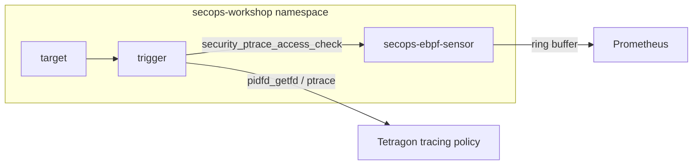

# CVE-2026-46333 Teardown Observability PoC

Defensive lab for observing `pidfd_getfd` and `ptrace` activity against a
lab-owned process. It does not attempt privilege escalation, secret access,
or enforcement.

## 1. Goal and Security Notice

This lab shows how to observe the kernel primitives associated with a
process-teardown race. It uses a dummy token file at
`/state/secops-lab-token.txt`, not real secrets.

The lab is intentionally split into two views:

- Tetragon gives you the raw event stream with Kubernetes context.
- Prometheus gives you rates, totals, and burst behavior.

## 2. Lab Architecture and Requirements

Requirements:

- Minikube with a kernel that exposes BTF at `/sys/kernel/btf/vmlinux`
- `kubectl`, `helm`, and Tetragon
- Prometheus for metrics
- A local image build path such as `minikube image build`

Layout:



- `target` creates the fake token file and keeps it open.
- `trigger` generates benign `pidfd_getfd` and `ptrace` activity.
- The pod shares a process namespace so the trigger can reach the target.

## 3. Core Flow

### Step 1: Start Minikube and build the image

```bash
minikube start -p secops-tetragon \
  --driver=kvm2 \
  --container-runtime=containerd \
  --kubernetes-version=v1.34.0 \
  --iso-url=https://storage.googleapis.com/minikube/iso/minikube-v1.38.0-amd64.iso

minikube -p secops-tetragon ssh -- '
uname -r
ls -lh /sys/kernel/btf/vmlinux
'

minikube image build -t secops-lab:local -f Containerfile .
```

### Step 2: Install Prometheus and Tetragon metrics

```bash
helm repo add prometheus-community https://prometheus-community.github.io/helm-charts
helm repo update
helm install kube-prometheus-stack prometheus-community/kube-prometheus-stack \
  --namespace monitoring --create-namespace \
  --set prometheus.prometheusSpec.serviceMonitorSelectorNilUsesHelmValues=false

helm repo add cilium https://helm.cilium.io
helm repo update
helm upgrade --install tetragon cilium/tetragon \
  --namespace kube-system \
  --set tetragon.prometheus.enabled=true \
  --set tetragon.prometheus.port=2112 \
  --set tetragon.prometheus.serviceMonitor.enabled=true \
  --set tetragonOperator.prometheus.enabled=true \
  --set tetragonOperator.prometheus.port=2113 \
  --set tetragonOperator.prometheus.serviceMonitor.enabled=true

kubectl -n monitoring port-forward \
  svc/$(kubectl -n monitoring get svc -l app.kubernetes.io/name=prometheus -o jsonpath='{.items[0].metadata.name}') \
  9091:9090
```

### Step 3: Deploy the workload and policies

Apply the baseline deployment and tracing policies:

```bash
kubectl apply -f lab-deploy.yaml
kubectl apply -f tetragon-policies.yaml
kubectl -n secops-workshop rollout status deploy/secops-lab -w
```

### Step 4: Inspect Tetragon and PromQL

If you want the raw event stream first, use Tetragon JSON:

```bash
TETRA_POD=$(kubectl -n kube-system get pod -l app.kubernetes.io/name=tetragon -o jsonpath='{.items[0].metadata.name}')
kubectl -n kube-system exec -it "$TETRA_POD" -c tetragon -- \
  tetra getevents --server-address unix:///var/run/tetragon/tetragon.sock -o json
```

The point of this step is to see the event before the graph:

- Tetragon shows the hook and Kubernetes context.
- Prometheus shows trends and burst patterns.
- Watching only `open` or `openat` is insufficient here because this lab
  is about `pidfd_getfd` and `ptrace`, not file-open telemetry.

<table>
  <thead>
    <tr>
      <th>PromQL</th>
      <th>Description</th>
    </tr>
  </thead>
  <tbody>
    <tr>
      <td><code>sum by (policy, hook, namespace) (rate(tetragon_policy_events_total[5m]))</code></td>
      <td>Tetragon policy events over time. You should see the baseline hooks when the trigger runs.</td>
    </tr>
    <tr>
      <td><code>tetragon_errors_total</code></td>
      <td>Tetragon health counter. It should stay at <code>0</code> in this lab.</td>
    </tr>
  </tbody>
</table>

### Step 5: Deploy the custom eBPF sensor

Apply the optional sensor DaemonSet:

```bash
kubectl apply -f ebpf-sensor-ds.yaml
kubectl -n secops-workshop rollout status ds/secops-ebpf-sensor -w
```

`main.ebpf.c` attaches at `fentry/security_ptrace_access_check`, filters
kernel threads, and exports ring-buffer events.

### Step 6: Hunt the mechanism

The DaemonSet starts in demo mode so you see events right away. To switch
to real mode, set `SENSOR_DEMO_MODE=0` and restart the DaemonSet:

```bash
kubectl -n secops-workshop set env ds/secops-ebpf-sensor SENSOR_DEMO_MODE=0
kubectl -n secops-workshop rollout status ds/secops-ebpf-sensor -w
```

Demo mode emits all ptrace checks so you can validate scraping, decoding,
and burst aggregation. Real mode only emits when `child->mm == NULL`.

<table>
  <thead>
    <tr>
      <th>PromQL</th>
      <th>Description</th>
    </tr>
  </thead>
  <tbody>
    <tr>
      <td><code>sum by (target_comm) (rate(secops_ptrace_access_events_total[5m]))</code></td>
      <td>Total ptrace access checks observed by the sensor.</td>
    </tr>
    <tr>
      <td><code>sum by (target_comm) (rate(secops_ptrace_mm_null_events_total[5m]))</code></td>
      <td>Only the <code>mm == NULL</code> path.</td>
    </tr>
    <tr>
      <td><code>sum by (target_comm) (rate(secops_ptrace_access_bursts_total[5m]))</code></td>
      <td>Repeated access checks in a short window. This is the retry-pattern view.</td>
    </tr>
  </tbody>
</table>

Interpretation:

- access events rising, but `mm_null` flat: the sensor is working, but the teardown predicate is not happening
- `mm_null` rising: the kernel state of interest was observed
- bursts rising: repeated access checks arrived fast enough to cross the threshold

## 4. Claims and Limits

What this PoC proves:

- visibility into the kernel primitives
- Kubernetes-enriched Tetragon events
- ring-buffer export from the custom sensor
- `task->mm == NULL` detection logic in the code path

What it does not prove:

- successful exploitation
- secret theft
- prevention or blocking
- deterministic observation of `target_mm_null=true` without a vulnerable
  kernel state or an artificial test fixture

How to read the evidence:

- `mm == NULL` is a strong signal that the teardown window was observed.
- It does not by itself prove successful exploitation.
- To claim impact, correlate that signal with successful unauthorized
  access to the sensitive file descriptor or token.

## 5. Cleanup

Remove the lab workloads and the sensor:

```bash
kubectl delete -f ebpf-sensor-ds.yaml
kubectl delete -f lab-deploy.yaml
kubectl delete -f tetragon-policies.yaml
```

If you installed the monitoring stack for the lab, remove it too:

```bash
helm uninstall kube-prometheus-stack -n monitoring
helm uninstall tetragon -n kube-system
```
